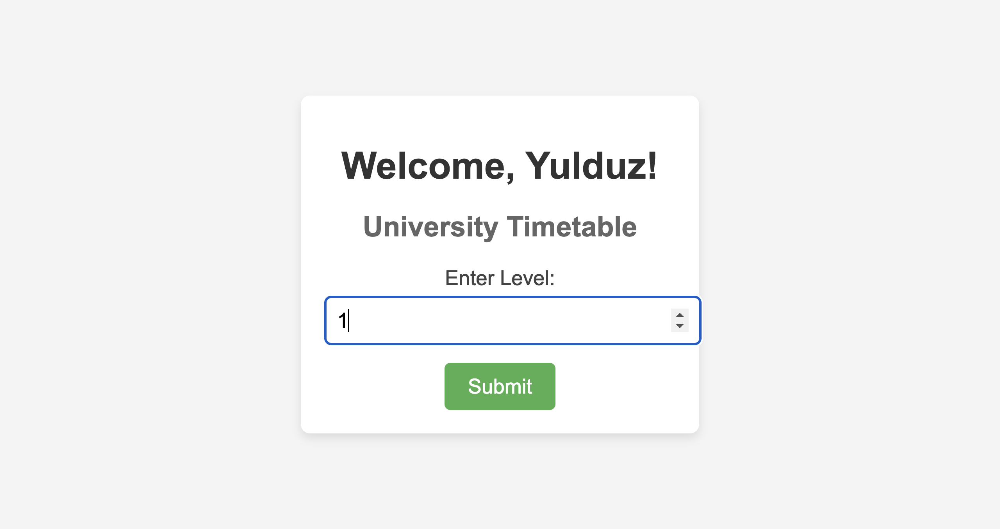

# University Timetable Web Application

## Project Description

This is a simple web app that shows university timetables. Users can enter their level (like Level 1 or Level 2) and see the courses for that level. The timetable shows the course ID, name, day, time, and room number. The app uses Flask for the backend, PostgreSQL for the database, and Docker to run everything.

---

## Steps Followed During Development

### 1. **Create the Project Files**

- I created the project folder and set up the files for Flask, Docker, and PostgreSQL.

**Project Structure:**
```
project/
        ├── app.py                  # Flask code
        ├── Dockerfile              # Docker setup for Flask
        ├── docker-compose.yml      # Docker settings for Flask and PostgreSQL
        ├── requirements.txt        # List of Python packages
        ├── templates/
        │    ├── index.html         # Home page HTML
        │    └── timetable.html     # Timetable page HTML
```

### 2. **Create Flask App**

- I wrote the Flask app with two pages:
- Home page where users can enter their level.
- timetable (Timetable page) where users can see the courses for their level.

```python
from flask import Flask, render_template, request
import pg8000
import os

app = Flask(__name__)

DB_HOST = os.environ.get("DB_HOST", "db")
DB_NAME = os.environ.get("DB_NAME", "Yulduz")
DB_USER = os.environ.get("DB_USER", "student")
DB_PASS = os.environ.get("DB_PASS", "student_pass")

@app.get("/")
def index():
    return render_template("index.html")

@app.get("/timetable")
def timetable():
    level = request.args.get("level")
    if not level:
        return "Enter a level", 400

    conn = pg8000.connect(
        user=DB_USER,
        password=DB_PASS,
        host=DB_HOST,
        port=5432,
        database=DB_NAME,
    )
    cur = conn.cursor()
    query = "SELECT course_id, course_name, day, time, room FROM Timetable WHERE level = %s;"
    cur.execute(query, (level,))
    rows = cur.fetchall()
    cur.close()
    conn.close()

    message = "No data found for this level." if not rows else None

    return render_template("timetable.html", data=rows, message=message, level=level)

if __name__ == "__main__":
    app.run(debug=True, host="0.0.0.0")
```

### 3. **Set Up PostgreSQL Database**

- I created a database and a table called Timetable to store the courses. I also added some sample data.

```sql
CREATE TABLE Timetable (
    course_id SERIAL PRIMARY KEY,
    course_name VARCHAR(255),
    day VARCHAR(50),
    time VARCHAR(50),
    room VARCHAR(50),
    level INT
);

INSERT INTO Timetable (course_name, day, time, room, level) VALUES
('Computer Languages', 'Monday', '02:00 PM - 04:20 PM', 'Room 114', 1),
('Operating Systems', 'Monday', '04:30 PM - 06:50 PM', 'Room 304', 1),
('Data Structures I', 'Monday', '11:30 AM - 01:50 PM', 'Room 304', 2),
('Calculus I', 'Tuesday & Thursday', '02:00 PM - 04:20 PM', 'WebNet+', 2),
('Introduction to Statistics', 'Friday', '11:30 AM - 01:50 PM', 'Room 313', 3);
```

### 4. **Use Docker for the Project**

- I used Docker to run the Flask app and PostgreSQL in separate containers. I also created a docker-compose.yml file to manage both containers together.

```yaml
version: '3.8'

services:
  db:
    image: postgres:latest
    container_name: yulduz-db
    environment:
      POSTGRES_USER: student
      POSTGRES_PASSWORD: student_pass
      POSTGRES_DB: Yulduz
    volumes:
      - db_data:/var/lib/postgresql/data
      - ./db_init:/docker-entrypoint-initdb.d
    ports:
      - "5432:5432"

  web:
    build: .
    container_name: yulduz-flask-app
    depends_on:
      - db
    ports:
      - "8080:5000"
    environment:
      - DB_HOST=db
      - DB_NAME=Yulduz
      - DB_USER=student
      - DB_PASS=student_pass
    volumes:
      - .:/app

volumes:
  db_data:
```

### 5. **Create the Frontend**

- I made simple HTML pages:
- index.html: A form where users enter their level.
- timetable.html: A table that shows the courses for the level entered.

```html
<!DOCTYPE html>
<html lang="en">
<head>
                <meta charset="UTF-8">
                <title>Mini project of Yulduz</title>
</head>
<body>
  <div class="container">
    <h1>Welcome, Yulduz!</h1>
    <h2>University Timetable</h2>
    <form method="GET" action="/timetable">
      <label for="level">Enter Level:</label>
      <input type="number" id="level" name="level" min="1" max="4" required />
      <button type="submit">Submit</button>
    </form>
  </div>
</body>
</html>
```

```html
<!DOCTYPE html>
<html lang="en">
<head>
                <meta charset="UTF-8">
                <title>Timetable for Level {{ level }}</title>
</head>
<body>
  <h2>Timetable for Level {{ level }}</h2>
  
  <table border="1">
    <thead>
      <tr>
        <th>Course ID</th>
        <th>Course Name</th>
        <th>Day</th>
        <th>Time</th>
        <th>Room</th>
      </tr>
    </thead>
    <tbody>
      
      <tr>
        <td>{{ row[0] }}</td>
        <td>{{ row[1] }}</td>
        <td>{{ row[2] }}</td>
        <td>{{ row[3] }}</td>
        <td>{{ row[4] }}</td>
      </tr>
      
    </tbody>
  </table>
  
  <p>{{ message }}</p>
  
  <br>
  <a href="/">Go Back</a>
</body>
</html>
```

### 6. **Connect the Frontend with the Backend**

- I used Flask to send data from the PostgreSQL database to the HTML pages. If there are no courses for the level entered, the app shows a message.

### 7. **Test the Application**

- I tested the app to make sure everything works. The timetable shows the correct courses for each level, and if no courses are found, it shows a message.

## Screenshots of the Final Web Application's Appearance

**Home Page**

This is the home page where users can input their level.



**Timetable Page**

This page shows the timetable for the entered level.


